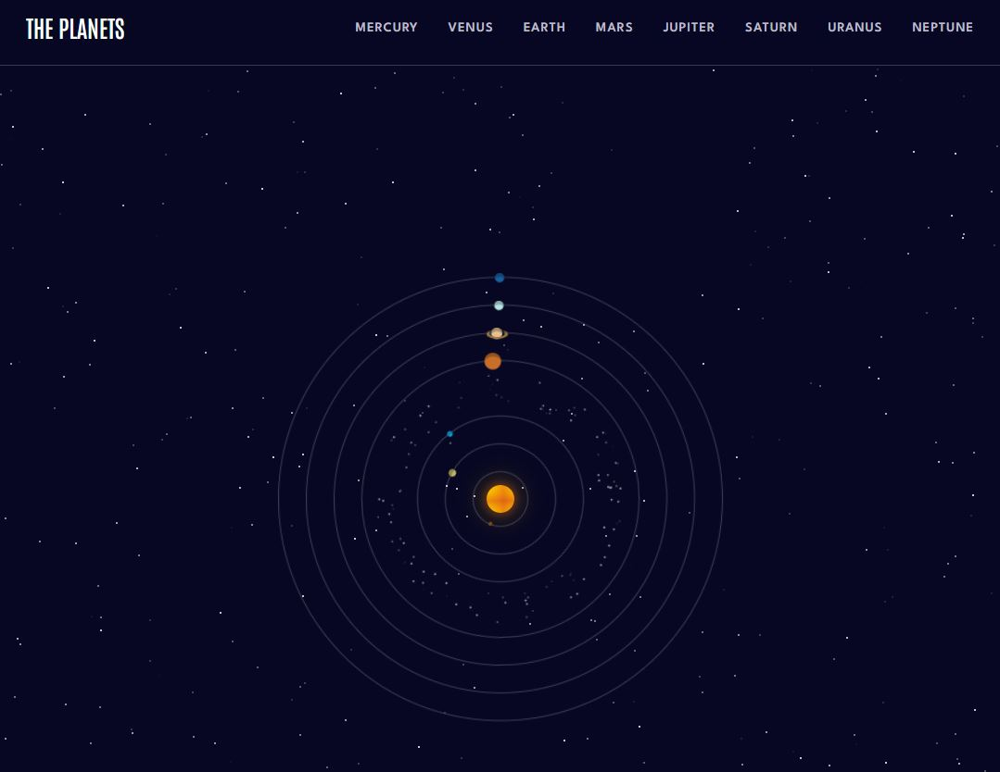
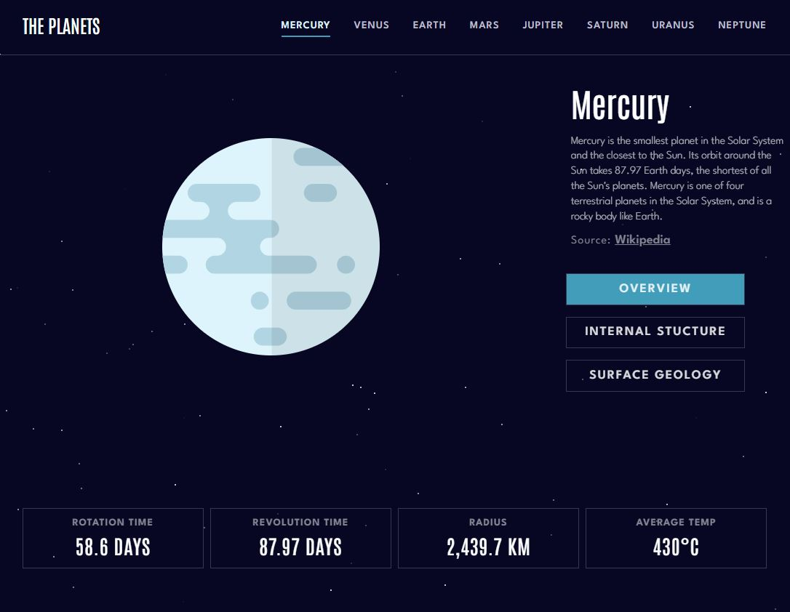

# Front-End Mentor || Planets Fact


Greetings! I'm excited to share my solution for the Planets fact site - a challenge by Frontend Mentor. This is my second project with Frontend Mentor, and I've built it using React JS. For this project, i've ventured into the realm of SCSS. SCSS is an incredibly powerful tool, and although I found my initial attempts a bit disorganized, I'm eager to hone my skills, clean up my code, and harness the full potential of SCSS. To add a bit of personal flair and veer away from the typical design, I've also integrated an animated solar system as the homepage. Additionally, I've incorporated transitions to enhance the user experience during subpage/route changes.

## Process

- I utilized the ReactJS library to build the application. ReactJS is known for being a declarative, efficient, and versatile JavaScript library, perfect for constructing engaging user interfaces.

- To bring life to the page transitions and mobile-menu animations, I employed the Framer Motion API. This open-source, production-grade library is crafted specifically for designing visually appealing animations.

- The animated solar system incorporated into the site is an adaptation from an exceptional Codepen by Malik Dellidj. It's ingeniously constructed using rotating divs with pseudo-elements containing the planetary images.

## Screenshots

### Solar System
<div align="center">
  
</div>

### Planets Page
<div align="center">
  
</div>


## Built With

- [React](https://reactjs.org/)
- [Framer Motion](https://www.framer.com/motion/)
- [React Icons](https://react-icons.github.io/react-icons/)
- [Sass](https://sass-lang.com/documentation/)
- [ESLint](https://eslint.org/)

## Installation

To run the application locally, follow these steps:

1. Clone the repository.
    ```
    git clone https://github.com/GabrielStefan24/planet-facts.git
    ```


2. Install dependencies.
    ```
    cd planet-facts
    npm install
    ```

3. Start the development server.
    ```
    npm run dev
    ```

4. Open [http://localhost:3000](http://localhost:3000) in your browser.

## Contributing

Pull requests are welcome. For major changes, please open an issue first to discuss what you would like to change.

## License

This project is licensed under the MIT License - see the [LICENSE.md](LICENSE.md) file for details. <!-- Replace with your license -->

## Contact

 - [Email](mailto:sirbugabriel97@gmail.com) 
 - [Linkedin](https://www.linkedin.com/in/gabriel-s-94a908236/)
